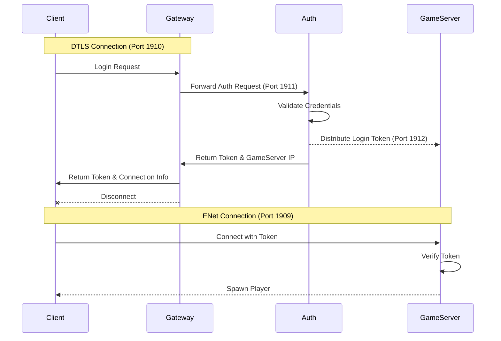

# Godot Multiplayer Game

A robust, distributed multiplayer architecture for Godot Engine 4.6+, featuring a secure multi-server setup with specialized components for authentication, load balancing, and dedicated game logic.

## 🚀 Overview

This project implements a scalable multiplayer system that separates concerns between different server types. This architecture ensures better security, scalability, and maintainability.

### Key Components

- **[Auth Server](GodotMultiplayerGameAuth)**: The source of truth for player data and credentials. Uses Godot 4.6 Mono
  - **[Player Data](GodotMultiplayerGameAuth/src/singleton/player_data.gd)**: Manages player data and credentials.
  - **[Server Communication](GodotMultiplayerGameAuth/src/singleton/server_communication.gd)**: Handles communication between servers.
  - **[Player Verification](GodotMultiplayerGameAuth/src/singleton/player_verification.gd)**: Handles player verification.
- **[Gateway Server](GodotMultiplayerGameGateway)**: A DTLS-secured entry point for clients to authenticate and register. Uses Godot 4.6 Mono
  - **[Gateway](GodotMultiplayerGameGateway/src/main/gateway.gd)**: Handles client authentication and registration.
  - **[Server Communication](GodotMultiplayerGameGateway/src/singleton/server_communication.gd)**: Handles communication between servers.
- **[Game Server](GodotMultiplayerGameServer)**: Authoritative game logic server where the actual gameplay happens. Uses Godot 4.6 Mono
  - **[Server](GodotMultiplayerGameServer/src/main/server.gd)**: Handles game logic and player management.
  - **[Server Communication](GodotMultiplayerGameServer/src/singleton/server_communication.gd)**: Handles communication between servers.
  - **[Combat](GodotMultiplayerGameServer/src/singleton/combat.gd)**: Handles combat logic.
- **[Game Client](GodotMultiplayerGameClient)**: The player's interface to the game world. Uses Godot 4.6
  - **[Client](GodotMultiplayerGameClient/src/main/client.gd)**: Handles client authentication and registration.
  - **[Server Communication](GodotMultiplayerGameClient/src/singleton/server_communication.gd)**: Handles communication between servers.
  - **[Login](GodotMultiplayerGameClient/src/main/login.gd)**: Handles client login.
  - **[Register](GodotMultiplayerGameClient/src/main/register.gd)**: Handles client registration.
- **[Certificate Generator](CertificateGenerator)**: A utility to generate SSL/TLS certificates for secure communication. Uses Godot 4.6 Mono

---

## 🏗 Architecture

The system uses a token-based handoff mechanism to move clients from authentication to gameplay.

### Communication Flow

---

## 🔌 Network Infrastructure

| Component | Connected To | Port | Protocol | Description |
| :--- | :--- | :--- | :--- | :--- |
| **Gateway** | Client | `1910` | ENet + DTLS | Public entry point for Auth/Register |
| **Auth** | Gateway | `1911` | ENet | Internal Auth processing |
| **Auth** | Game Server | `1912` | ENet | Token distribution interface |
| **Game Server** | Client | `1909` | ENet | Authoritative Game State |

---

## 🛠 Setup & Running

### 1. Security First

Before running the servers, you must generate the necessary SSL/TLS certificates for the Gateway.

1. Run the **CertificateGenerator** project.
2. It will generate `X509_Certificate.crt` and `X509_key.key` in your user data directory.
3. Copy these to the `res://cert/` folder of both the **Gateway** and **Client** projects.

### 2. Startup Order

To ensure proper handshakes between internal components, start them in this order:

1. **Auth Server**
2. **Game Server** (Connects to Auth)
3. **Gateway Server** (Connects to Auth)
4. **Client**

---

## 📂 Project Structure

- `GodotMultiplayerGameAuth/`: Manages `player_data.json` and session tokens.
- `GodotMultiplayerGameGateway/`: Handles client requests and provides SSL termination.
- `GodotMultiplayerGameServer/`: authoritative server with combat systems and player stats.
- `GodotMultiplayerGameClient/`: UI for login/register and the game scene.

---

> [!NOTE]
> This project is built for **Godot 4.6 Forward Plus**. Ensure all components are running the same engine version to avoid compatibility issues.
